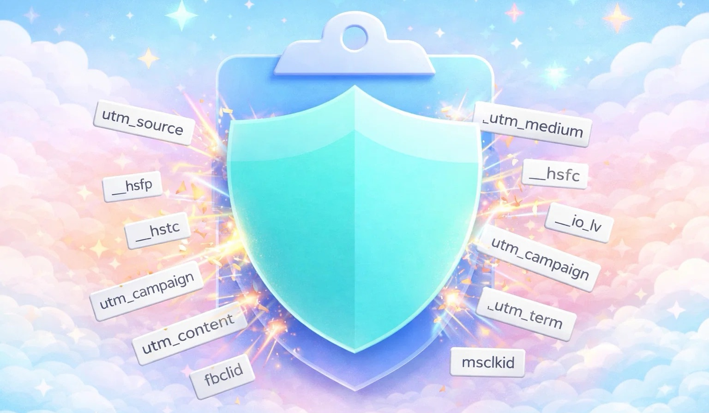

# PurePaste



PurePaste is a privacy friendly utility that cleans common tracking parameters from URLs you copy.
For more serious tools, please checkout [uBO](https://github.com/gorhill/uBlock).


**Install steps**:
- [**Download ZIP here**](https://github.com/jayf0x/Pure-Paste/releases/latest)
- Open `Terminal`, and paste `xattr -dr com.apple.quarantine ~/Downloads/PurePaste.app` (security doesn't like none identified developers).
- Move the app to Applications, or again paste `mv ~/Downloads/PurePaste.app /Applications/PurePaste.app`
- open the app

or if you want to package locally, run [`bash ./scripts/build-dmg.sh`](./scripts/build-dmg.sh).


## How it works

PurePaste watches your clipboard while active, 
removes tracking params and updates the clipboard.

In the app menu:
- **Options > Refetch rules** reloads the latest `parsedRules.json` from the repo URL.
- **Options > Reset counter** resets the global removed-parameter counter.


## Contribution
This project includes and modifies rule data from:

- uBlock Origin uAssets
  https://github.com/uBlockOrigin/uAssets
  Licensed under GPL-3.0

- ClearURLs Rules
  https://gitlab.com/ClearURLs/rules
  Licensed under LGPL-3.0

The [merged rules](./assets/parsedRules.json) (from [ubo](https://raw.githubusercontent.com/uBlockOrigin/uAssets/master/filters/privacy-removeparam.txt) and [ClearUrl](https://gitlab.com/ClearURLs/rules/-/raw/master/data.min.json)) are licensed
under GPL-3.0.


## Uninstall
```sh
pkill PurePaste
trash /Applications/PurePaste.app
trash ~/Library/Application\ Support/PurePaste/ 2>&1
```
